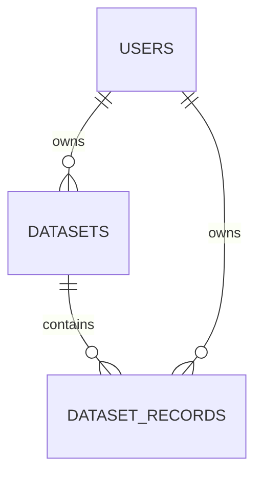

# Infrastructure research dataset

This is **synthetic teaching data**, not evidence of real infrastructure projects. It contains 120 fictional projects across 20 real cities, with six categories per city. No personal information or external research calls were used to generate it.

- [Excel workbook](infrastructure-projects.xlsx): one `projects` sheet with 120 data rows plus a header.
- [UTF-8 CSV](infrastructure-projects.csv): the same columns and rows, with quoted fields and CRLF line endings.
- [Manifest and column dictionary](manifest.json): record count, provenance and field meanings.

Open the workbook in Excel or LibreOffice and export the `projects` sheet as **CSV UTF-8, comma-delimited**. Do not choose a locale-dependent semicolon delimiter. The supplied generator exports both formats and verifies every value matches.

## Generate and verify

From repository root, with dependencies installed and Node 22.18+:

```bash
npm run dataset:generate
```

The script runs under Node and uses `node:fs/promises` to read input files and write the workbook, CSV and manifest. It validates full table contents; the existing attachment profile is a separate, sampled representation used for research.

## Seed the isolated demo database

Configure `MONGODB_URI` in the local `apps/api/.env`. The seed explicitly targets **atlas_course_demo**, regardless of `MONGODB_DB_NAME`. MongoDB must support transactions (Atlas or a replica set).

```bash
npm run dataset:seed -- data/course/infrastructure-projects.csv /tmp/atlas-course-seed.json --apply
```

The `.xlsx` file is accepted in place of the CSV. The seed validates that its input matches the generated synthetic dataset before connecting. It creates one synthetic owner in `users`, one entry in `datasets`, and 120 entries in `dataset_records`. Mongoose models are defined before the dataset insertion. The owner has no login identity or password and cannot log in.

Each record has a `datasetId`, `ownerId`, zero-based `position`, and ordered string `values`. Dataset metadata holds its columns, name, owner, record count and creation time. String values preserve identifiers, Unicode and leading zeros consistently across Excel and CSV. `investment_eur` contains whole euros encoded as text; consumers can convert that column explicitly for calculations.

The seed repeats the same transactional write and reads it back to verify counts, references and repeatability. It writes a JSON verification report to the path supplied. It does not enqueue research or create completed research runs.



## Use in Atlas

1. In the research question box, open **Saved datasets**, choose **Save a dataset**, and select a CSV or XLSX file. CSV files and single-sheet workbooks are validated and saved under your signed-in account. The synthetic seed owner is separate.
2. For a workbook with multiple worksheets, the panel shows **Worksheets to import** with sheet names, row counts and column counts. Choose one worksheet or **All worksheets**, then **Import worksheets**. Each selected sheet becomes a separate dataset with its own columns; sheets with different structures are not merged. **Cancel** saves nothing. Previewing the workbook does not save it.
3. Choose **Use** on a saved dataset to export its table as CSV and upload it as a research attachment. This prepares a table profile; it does not start an AI call. The download icon exports the saved table as CSV, and the delete icon removes that dataset.
4. Add any instructions and submit to interpret the attachment. AI receives the table profile, including a preview of the first 20 rows, and your instructions. It returns a summary and proposed research question, or asks for clarification.
5. Review and edit the question, or request refinement. Submit the accepted question to start the existing research flow. Research execution needs an active worker and configured providers.

The panel displays file names and row/column counts, keeps long lists scrollable, and groups import choices separately from saved files. Open **Supported files & limits** for the import constraints.

```mermaid
flowchart LR
    Upload[Choose CSV or Excel] --> Select[Choose one or all worksheets]
    Select --> Save[Save each selected table]
    Save --> Use[Use one dataset as CSV attachment]
    Use --> Profile[Profile with first 20 rows]
    Profile --> Interpret[User submits for AI interpretation]
    Interpret --> Review[Review proposed question]
    Review --> Research[Submit research question]
```



Saving, downloading and attaching do not invoke an AI provider. Interpretation and research are separate user-triggered steps. Uploaded rows are not automatically mapped, and Atlas does not run research for each row. Map points come from the resulting research claims. All 120 course records are stored, but the preview does not establish exhaustive analysis of every project.

## Import limits and data handling

| Limit | Scope |
| --- | --- |
| 5 MB input | Entire uploaded CSV or XLSX file |
| 10 worksheets | Selected sheets per import; choose one if importing all exceeds the limit |
| 1–1,000 data rows | At least one row per selected sheet, at most 1,000 rows across the selection |
| 1–50 columns | Each selected sheet, with unique non-empty column names |
| 5 MB exported CSV | Combined UTF-8 CSV size of the selected sheets |

Column names can contain up to 120 characters and cell values up to 2,000 characters. Formulas and formula-like values are rejected; use plain cell values. Each row must match the header width. Empty formatting beyond the last populated XLSX column and trailing blank rows are trimmed; populated cells and blank cells within the table are preserved. Workbook parsing also enforces bounds on expanded size and cell counts.

All selected tables are validated before saving, and their datasets and records are written in one MongoDB transaction. An invalid selected sheet rejects the entire import. Each saved sheet can be used, downloaded or deleted independently. The course seed continues to accept only the supplied single-sheet synthetic dataset.

Downloads pending when the dataset component unmounts, including on account change, cannot subsequently attach that file.

## Acceptance and validation

The owner accepted the redesigned dataset panel and reported the live flow working on 2026-09-15. A three-sheet workbook also passed in-memory API checks for preview, importing all sheets, importing one sheet, CSV downloads and research profiling with the first 20 rows.

The focused validation passed 41 API/parser/import tests and eight dataset UI/hook tests, plus TypeScript, Biome and the web build. Limit tests were observed failing with their guards removed. Deployment verification and the separate Node API/worker runtime requirement remain outside this acceptance.

## Verification commands

```bash
node --experimental-transform-types apps/api/scripts/datasets/verify-http.ts
node --env-file=apps/api/.env --experimental-transform-types apps/api/scripts/datasets/verify-persistence.ts
```

The persistence check writes only to `atlas_course_demo` and removes the temporary dataset it creates. It checks owner isolation, transactional rollback and deletion of associated rows. The HTTP check uses an in-memory app with no database writes. It runs under Node because Bun 1.2.20's Fastify injection path can execute a handler after an early authentication reply; that issue reproduces independently of dataset routes.

These tools establish a Node filesystem workflow and Mongoose-backed dataset storage. The application's API and worker still launch with Bun; meeting a separate Node backend runtime requirement remains additional work.
