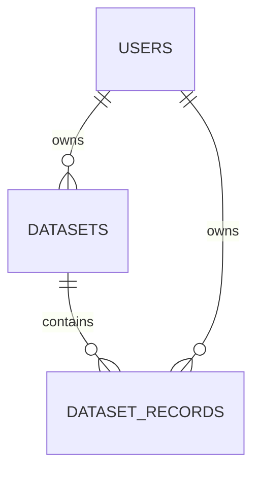

# Infrastructure research dataset

This is **synthetic teaching data**, not evidence of real infrastructure projects. It contains 120 fictional projects across 20 real cities, with six categories per city. No personal information or external research calls were used to generate it.

- [Excel workbook](infrastructure-projects.xlsx): one `projects` sheet with 120 data rows plus a header.
- [UTF-8 CSV](infrastructure-projects.csv): the same columns and rows, with quoted fields and CRLF line endings.
- [Manifest and column dictionary](manifest.json): record count, provenance and field meanings.

Open the workbook in Excel or LibreOffice and export the `projects` sheet as **CSV UTF-8, comma-delimited**. Do not choose a locale-dependent semicolon delimiter. The supplied generator exports both formats and verifies every value matches.

## Generate and verify

From repository root, with dependencies installed and Node 22.18+:

```bash
npm run dataset:generate
```

The script runs under Node and uses `node:fs/promises` to read input files and write the workbook, CSV and manifest. It validates full table contents; the existing attachment profile is a separate, sampled representation used for research.

## Seed the isolated demo database

Configure `MONGODB_URI` in the local `apps/api/.env`. The seed explicitly targets **atlas_course_demo**, regardless of `MONGODB_DB_NAME`. MongoDB must support transactions (Atlas or a replica set).

```bash
npm run dataset:seed -- data/course/infrastructure-projects.csv /tmp/atlas-course-seed.json --apply
```

The `.xlsx` file is accepted in place of the CSV. The seed validates that its input matches the generated synthetic dataset before connecting. It creates one synthetic owner in `users`, one entry in `datasets`, and 120 entries in `dataset_records`. Mongoose models are defined before the dataset insertion. The owner has no login identity or password and cannot log in.

Each record has a `datasetId`, `ownerId`, zero-based `position`, and ordered string `values`. Dataset metadata holds its columns, name, owner, record count and creation time. String values preserve identifiers, Unicode and leading zeros consistently across Excel and CSV. `investment_eur` contains whole euros encoded as text; consumers can convert that column explicitly for calculations.

The seed repeats the same transactional write and reads it back to verify counts, references and repeatability. It writes a JSON verification report to the path supplied. It does not enqueue research or create completed research runs.



## Use in Atlas

In the research question box, open **Saved datasets**, choose **Save a dataset**, and select either supplied file. The saved dataset belongs to the signed-in user; the synthetic seed owner is separate. Choose **Use** to attach its CSV representation to a new research question. Saving and downloading do not invoke an AI provider. Interpretation and research follow the existing provider and worker flow.

All 120 records are saved. The existing research attachment flow uses a preview of the first 20 rows, so it does not establish exhaustive analysis of every project. Saved datasets accept one sheet, 1–1000 data rows, 1–50 uniquely named columns, and files up to 5 MB. Formulas and formula-like values are rejected; use plain cell values. Each row must match the header width.

## Verification commands

```bash
node --experimental-transform-types apps/api/scripts/datasets/verify-http.ts
node --env-file=apps/api/.env --experimental-transform-types apps/api/scripts/datasets/verify-persistence.ts
```

The persistence check writes only to `atlas_course_demo` and removes the temporary dataset it creates. It checks owner isolation, transactional rollback and deletion of associated rows. The HTTP check uses an in-memory app with no database writes. It runs under Node because Bun 1.2.20's Fastify injection path can execute a handler after an early authentication reply; that issue reproduces independently of dataset routes.

These tools establish a Node filesystem workflow and Mongoose-backed dataset storage. The application's API and worker still launch with Bun; meeting a separate Node backend runtime requirement remains additional work.
