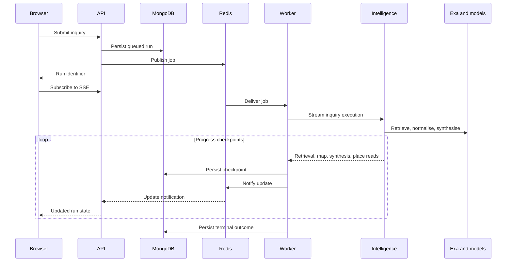

# AI execution

[Architecture](architecture.md) · [Data](data.md) · [Setup](setup.md)

The registered `inquiry` runner is `ClaimsLensGraph`. It retrieves claims and documents through `ExaClaimSource`, normalises locations, groups claims by place, and synthesises an Intelligence summary. Claims that cannot be placed are counted separately. The map is available before synthesis completes.

## Providers and configuration

Text adapters support the configured OpenAI or Cerebras provider. The checked-in model default is `gpt-4o-mini`; configuration selects the runtime model. Place normalisation has configurable batch size and concurrency. Exa search type and result count are also configurable.

The `attachment-interpretation` graph is separate. The API can call it directly to interpret tabular or image context and propose a question. See [graph registration](../services/intelligence/app/graphs/register.py) and [settings](../services/intelligence/app/core/config.py).

## Progress and failure

Progress stages include `retrieval_complete`, `map_ready`, `synthesis_ready` and `place_read_ready`, followed by terminal state. The worker persists checkpoints and coordinates job recovery; the browser receives run updates through the API, without calling Python directly.

Run outcomes distinguish `succeeded`, `no_coverage`, `below_floor`, `failed_retryable` and `failed_permanent`. Worker orchestration can retain a durable map as a degraded result when later enrichment fails. Retry limits, deadlines and ownership recovery live in the TypeScript execution path. A resumed graph call does not by itself imply a persisted LangGraph checkpoint: the inquiry graph's `resume` method calls `run` again.

## Evidence and cost

Claims retain source URLs and titles; source documents and mapped claims are stored with the run. Generated summaries should be assessed against that evidence. Place reads are validated against the candidate places and source URLs supplied to synthesis.

Retrieval reports cost and whether it was provider-reported; configurable Exa unit prices support estimates. Admin retrieval spend is not a complete bill for all model usage. Optional LangSmith tracing provides execution observability. No live pricing claim is implied by configured price defaults.

Source: [claims graph](../services/intelligence/app/graphs/claims_lens.py), [worker execution](../packages/application/src/inquiry/inbound/execute-inquiry-run.ts).

## Planned retrieval sources

Polymarket information and relevant X.com posts and discussions are planned as additional research inputs. Exa remains the implemented research retrieval source.
