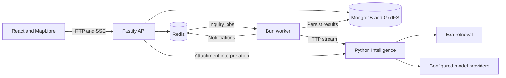
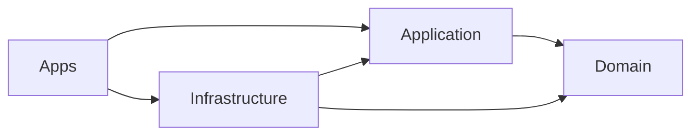

# Architecture

[Project overview](../README.md) · [Setup](setup.md) · [AI execution](ai.md)

The API accepts authenticated requests and coordinates use cases. A separate worker consumes inquiry jobs and calls the Python Intelligence service. MongoDB holds durable application state; Redis provides jobs, notifications, sessions and verification state.

## Repository layout

| Path | Responsibility |
| --- | --- |
| `apps/web` | App shell and feature UI; browser repositories and state |
| `apps/api` | Fastify routes, request parsing, authentication gates, dependency wiring |
| `apps/worker` | Queue consumption, ownership recovery and shutdown |
| `packages/domain` | Entities, roles, inquiry states and domain rules |
| `packages/application` | Use cases and outbound port contracts |
| `packages/infrastructure` | MongoDB, Redis, HTTP, identity, email and file adapters |
| `packages/shared` | Shared utilities and execution defaults |
| `packages/ui` | Reusable UI components |
| `services/intelligence` | Python graphs, provider adapters and HTTP endpoints |
| `deploy/vps` | Container builds, reverse proxy configuration and release script |

## Dependency boundaries

Dependencies point inward. Application code depends on domain contracts; infrastructure implements outbound ports. Apps compose implementations. The web app does not import server application orchestration into its bundle.

The TypeScript worker calls `OrchestrationPort` through the HTTP adapter. Python owns graph execution and model calls. Claims, places and source documents are embedded in inquiry-run records, as detailed in [data](data.md).

Source entry points: [API bootstrap](../apps/api/src/core/bootstrap.ts), [worker](../apps/worker/src/main.ts), [graph registration](../services/intelligence/app/graphs/register.py).
