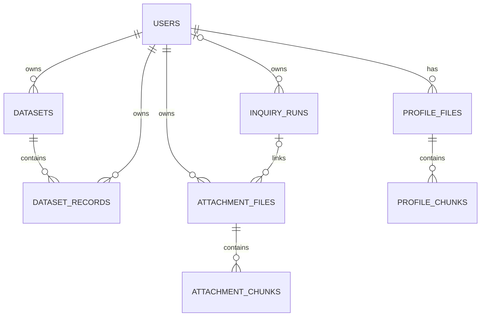

# Data and seeds

[Architecture](architecture.md) · [Course adaptation](course.md)

Atlas uses the native MongoDB driver for existing account/research storage and Mongoose for saved datasets. Dataset writes use transactions and require MongoDB replica-set support.

## Relationships



These are logical references, not database-enforced foreign keys. The diagram uses readable aliases for the physical collections below.

| Collection | Data and references |
| --- | --- |
| `users` | String `_id`, email, role, profile, identity records and authentication version |
| `datasets` | Dataset ID, owner ID, name, columns, record count and creation time |
| `dataset_records` | Dataset ID, owner ID, row position and ordered string values |
| `inquiry_runs` | String `_id`; nullable `ownerId` references a user; question, status, progress, costs, embedded places/claims/documents and synthesis |
| `inquiry_attachments.files` | GridFS metadata; `metadata.ownerId` references a user, nullable `metadata.runId` references a run, `metadata.id` is the application attachment ID |
| `inquiry_attachments.chunks` | GridFS bytes linked by `files_id` to a file's GridFS `_id` |
| `profile_images.files` | GridFS images whose `filename` identifies the owning user |
| `profile_images.chunks` | GridFS bytes linked to image files |

Attachment usage counters are stored separately. Redis holds sessions, verification tokens, login state and inquiry queue/notification data. Claims and places are embedded objects, not independent MongoDB collections.

Source: [user adapter](../packages/infrastructure/src/user-store-mongodb/index.ts), [run documents](../packages/infrastructure/src/store-mongodb/collections.ts), [attachment adapter](../packages/infrastructure/src/inquiry-attachment-mongodb/index.ts), [profile images](../packages/infrastructure/src/profile-image-mongodb/index.ts).

## Existing admin seed

`apps/api/scripts/seed-admin.ts` creates a verified super admin or promotes an existing account. It requires `MONGODB_URI`, `SEED_ADMIN_EMAIL` and `SEED_ADMIN_PASSWORD`. Set `MONGODB_DB_NAME` explicitly to avoid its `atlas` default. After selecting an appropriate database and authorizing that write, run from `apps/api`:

```bash
bun run seed:admin
```

This script changes privileges. It is not a related research dataset importer. Migration scripts are also separate from seeds and may modify or remove existing data.

## Course dataset status

The [course dataset guide](../data/course/README.md) documents the delivered 120-row synthetic workbook, matching CSV, Node filesystem generator, Mongoose-backed seed and user-facing save/use/interpret/research flow. The seed targets `atlas_course_demo` and creates a synthetic owner plus related datasets and records; it does not create research runs. Existing production research and personal accounts are not demonstration seed material.

All uploaded rows are saved, but research interpretation uses a profile containing the first 20 rows. Saving does not trigger AI, and rows do not automatically become map points. See the guide for limits and the separate user-triggered interpretation and research steps.
