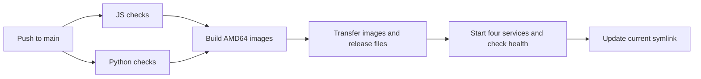

# CI and VPS deployment

[Project overview](../README.md) · [Setup](setup.md)

The [CI workflow](../.github/workflows/ci.yml) validates JavaScript and Python separately. Pull requests run checks. A push to `main` deploys only after both jobs pass. There is no deployment-enable variable gate.

## Release flow

The workflow builds `atlas-web`, `atlas-backend` and `atlas-intelligence`, tagged with the full commit SHA. It transfers image archives over SSH and loads them on the VPS. SSH requires repository secrets `ATLAS_SSH_PRIVATE_KEY` and `ATLAS_SSH_KNOWN_HOSTS`. The SSH destination is currently specified in the workflow; adapting deployment to another host requires updating it and provisioning that host.

The host must provide Docker Compose, the deploy user's required noninteractive sudo access, `/opt/atlas/.env`, and an HTTPS reverse proxy. Use the [environment example](../deploy/vps/.env.example) and [host proxy configuration](../deploy/vps/nginx.host.conf) as configuration references. Keep runtime secrets on the host.

## Release layout and checks

- `/opt/atlas/releases/<full-sha>/` holds the Compose manifest and deployment script.
- `/opt/atlas/.env` holds runtime configuration.
- `/opt/atlas/deploy.lock` serialises release execution.
- `/opt/atlas/current` points to the release after its checks pass.

The [release script](../deploy/vps/deploy.sh) preserves `ATLAS_IMAGE_TAG` through sudo, validates Compose configuration, starts Redis, Intelligence, API and web, and waits for health checks. It then checks web `/` and proxied `/api/health` before updating `current`.

Web binds to host loopback port 3080 by default. Its Nginx proxies API traffic internally. Redis uses an internal Compose network and a persistent volume. MongoDB is external to this Compose stack.

The deployment is an in-place Compose update. It does not implement automatic rollback or an atomic traffic switch. A failed release can leave changed containers even if `current` still points to the prior release; inspect container image tags and health, not only the symlink.

## Worker policy

The worker belongs to the `research` Compose profile and is excluded from the standard release. The script refuses to deploy while an Atlas worker container is running. Permanent worker operation therefore needs a deliberate deployment-policy change.

Before starting a worker, inspect current pending and recoverable jobs and coordinate the worker against the shared database and queue. Select the allowed research scope and stopping condition. Enabling it can immediately trigger paid external calls.

After release, confirm the expected full SHA in the release path and application image tags, container health, public HTTPS access, and the [live acceptance cases](use-cases.md). A deployment health check does not test OAuth, email delivery or a complete research run.
